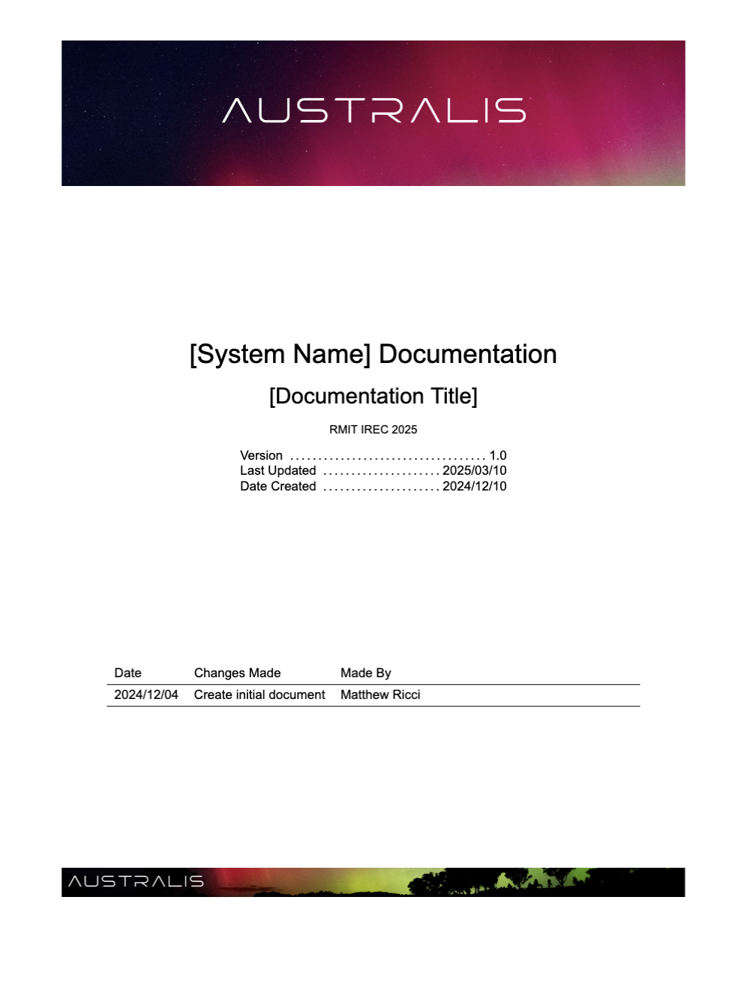

# RMIT HIVE System Documentation Template

## Setup

1. Configure your compiler to use `XeLaTeX`

> ![NOTE]
> If using VS Code, settings automatically sourced in `.vscode/settings.json` should do this for you

## Usage

Editable areas are commented, most edits are made from about line `337` and below in `main.tex`

## Example Document

